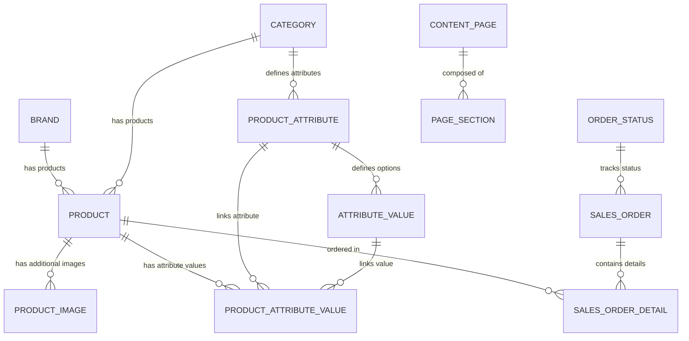

# تحليل شامل لمشروع FTD TechZone (متجر الفجر للتجارة الإلكتروني)

مرحباً بك! يهدف هذا الملف إلى تقديم تحليل هيكلي وتقني مفصل ومكامل لمشروع **FTD TechZone**، وهو عبارة عن منصة تجارة إلكترونية متكاملة مصممة خصيصاً لشركة **الفجر للتجارة (Alfajr For Trade)** في مصر. تم بناء المشروع باستخدام بيئة عمل **ASP.NET Core 8.0 MVC** مع نظام **Entity Framework Core 8.0** وقاعدة بيانات **SQL Server**.

تم إعداد هذا الملف كمرجع رئيسي ومستند توثيقي شامل لتسهيل عملية التطوير القادمة وتوضيح دور كل ملف ووحدة برمجية في النظام.

---

## 📌 جدول المحتويات
1. [نظرة عامة على المشروع والتقنيات المستخدمة](#1-نظرة-عالمة-على-المشروع-والتقنيات-المستخدمة)
2. [هيكل المجلدات وملفات المشروع الرئيسية](#2-هيكل-المجلدات-وملفات-المشروع-الرئيسية)
3. [تحليل قاعدة البيانات ونماذج البيانات (Domain Models)](#3-تحليل-قاعدة-البيانات-ونماذج-البيانات-domain-models)
4. [بذر البيانات الافتراضية (Database Seeding)](#4-بذر-البيانات-الافتراضية-database-seeding)
5. [تحليل طبقة الخدمات المنطقية (Services Layer)](#5-تحليل-طبقة-الخدمات-المنطقية-services-layer)
6. [تحليل طبقة التحكم والمتحكمات (Controllers)](#6-تحليل-طبقة-التحكم-والمتحكمات-controllers)
7. [الواجهات والتنسيق البصري (Views & Layouts)](#7-الواجهات-والتنسيق-البصري-views--layouts)
8. [تنظيف المجلدات التالفة (Cleanup Recommendations)](#8-تنظيف-المجلدات-التالفة-cleanup-recommendations)
9. [دليل التشغيل وخطوات البدء في التطوير](#9-دليل-التشغيل-وخطوات-البدء-في-التطوير)
10. [أفكار مقترحة للتطوير المستقبلي](#10-أفكار-مقترحة-للتطوير-المستقبلي)

---

## 1. نظرة عامة على المشروع والتقنيات المستخدمة

المشروع عبارة عن موقع تجارة إلكترونية ثنائي اللغة (عربي/إنجليزي) يتيح تصفح المنتجات وفلترتها بالاعتماد على الخصائص التقنية (مثل سعة الذاكرة، الألوان، قوة المروحة، إلخ)، ويحتوي على سلة تسوق ديناميكية، ونظام إرسال وتأكيد طلبات الشراء، بالإضافة إلى لوحة تحكم إدارية كاملة للمشرفين (Admin Panel) لإدارة المنتجات، الطلبات، المحتوى، والقوائم.

### التقنيات الأساسية (Tech Stack):
*   **إطار العمل:** [ASP.NET Core 8.0 MVC](file:///c:/Users/dell/Documents/unigroup/New%20folder/FTD.Web/FTD.Web.csproj) (بنية MVC نقية ومخصصة بالكامل بدون استخدام Razor Pages لضمان سرعة الاستجابة والمرونة التامة).
*   **قاعدة البيانات:** SQL Server مع [EF Core 8.0](file:///c:/Users/dell/Documents/unigroup/New%20folder/FTD.Web/FTD.Web.csproj) لربط وإدارة الكائنات البرمجية بالجداول (Code-First Approach).
*   **نظام الصلاحيات والحماية:** ASP.NET Core Identity لتوثيق وإدارة حساب المشرفين بصلاحية `Admin` مع حماية لوحة التحكم.
*   **التنسيق البصري:** Vanilla CSS و Vanilla JS مخصص بالكامل لضمان سرعة التحميل الفائقة ودعم التجاوب وشاشات الموبايل والتوافق مع الاتجاهين (RTL/LTR).
*   **إدارة الجلسات:** Session-based State لتخزين وحفظ عناصر سلة التسوق للمستخدمين دون الحاجة لتسجيل الدخول.
*   **التنبيهات البريدية:** SMTP Mailer لإرسال إشعارات فورية منسقة بصيغة HTML للمسؤولين عند ورود رسائل جديدة من العملاء.

---

## 2. هيكل المجلدات وملفات المشروع الرئيسية

ينقسم المشروع البرمجي في المجلد [FTD.Web](file:///c:/Users/dell/Documents/unigroup/New%20folder/FTD.Web) إلى الهيكل التنظيمي التالي:

*   📂 **[Controllers](file:///c:/Users/dell/Documents/unigroup/New%20folder/FTD.Web/Controllers):** يحتوي على متحكمات معالجة الطلبات للواجهة العامة، بالإضافة إلى مجلد فرعي للوحة التحكم:
    *   📂 **[Admin](file:///c:/Users/dell/Documents/unigroup/New%20folder/FTD.Web/Controllers/Admin):** متحكمات لوحة الإدارة.
*   📂 **[Data](file:///c:/Users/dell/Documents/unigroup/New%20folder/FTD.Web/Data):** يحتوي على سياق قاعدة البيانات [AppDbContext.cs](file:///c:/Users/dell/Documents/unigroup/New%20folder/FTD.Web/Data/AppDbContext.cs) الذي يحدد الجداول والعلاقات والبيانات الأولية.
*   📂 **[Models](file:///c:/Users/dell/Documents/unigroup/New%20folder/FTD.Web/Models):** يحتوي على ملف [DomainModels.cs](file:///c:/Users/dell/Documents/unigroup/New%20folder/FTD.Web/Models/DomainModels.cs) الذي يضم جميع نماذج البيانات وجداول قاعدة البيانات.
*   📂 **[ViewModels](file:///c:/Users/dell/Documents/unigroup/New%20folder/FTD.Web/ViewModels):** يحتوي على [ViewModels.cs](file:///c:/Users/dell/Documents/unigroup/New%20folder/FTD.Web/ViewModels/ViewModels.cs) ويضم كائنات نقل البيانات بين المتحكم والقالب لعرضها بدقة.
*   📂 **[Services](file:///c:/Users/dell/Documents/unigroup/New%20folder/FTD.Web/Services):** يحتوي على ملفات الخدمات الخدمية لمنطق العمل والبريد الإلكتروني.
*   📂 **[Migrations](file:///c:/Users/dell/Documents/unigroup/New%20folder/FTD.Web/Migrations):** يحتوي على ملفات الترحيل والتحديث الهيكلي لقاعدة البيانات وتاريخ تطور الجداول.
*   📂 **[Views](file:///c:/Users/dell/Documents/unigroup/New%20folder/FTD.Web/Views):** مجلد قوالب الـ HTML وواجهات العرض (cshtml) المنقسمة بحسب المتحكم والصفحة.
*   📂 **[wwwroot](file:///c:/Users/dell/Documents/unigroup/New%20folder/FTD.Web/wwwroot):** مجلد الملفات الاستاتيكية العامة (CSS, JS, الصور المرفوعة للمنتجات والشعارات والمكتبات).
*   📄 **[Program.cs](file:///c:/Users/dell/Documents/unigroup/New%20folder/FTD.Web/Program.cs):** الملف الأساسي لتشغيل التطبيق، وتسجيل الخدمات البرمجية (Dependency Injection)، وإعداد أنابيب المعالجة (Middleware)، وضبط مسارات التنقل (Routing).
*   📄 **[appsettings.json](file:///c:/Users/dell/Documents/unigroup/New%20folder/FTD.Web/appsettings.json):** ملف الإعدادات العامة ويحتوي على نص اتصال قاعدة البيانات (ConnectionString) وإعدادات SMTP للبريد الإلكتروني.

---

## 3. تحليل قاعدة البيانات ونماذج البيانات (Domain Models)

تتألف قاعدة البيانات في ملف [DomainModels.cs](file:///c:/Users/dell/Documents/unigroup/New%20folder/FTD.Web/Models/DomainModels.cs) من مجموعة من النماذج المترابطة التي تدعم هيكلية المتجر ثنائية اللغة:



### تفاصيل الجداول والكائنات البرمجية:

1.  **Brand (العلامات التجارية):**
    *   تمثل الشركات المصنعة للأجهزة المعروضة (مثل DOOGEE, Dreame, JisuLife).
    *   تحتوي على الاسم باللغتين العربية والانجليزية (`NameAr`, `NameEn`)، الاسم اللطيف للرابط (`Slug`)، الشعار (`LogoPath`)، صورة البانر (`BannerPath`)، ووصف تفصيلي للشركة المصنعة.
2.  **Category (التصنيفات):**
    *   تمثل المجموعات الأساسية للمنتجات (مثل تابلتات، مراوح محمولة، كاميرات ويب).
    *   تحتوي على حقول الاسم باللغتين والـ `Slug` وأيقونة تعبيرية (`Emoji`) لسهولة العرض في القوائم.
3.  **Product (المنتجات):**
    *   يمثل الكائن الأساسي المعروض للبيع. يرتبط بـ `CategoryId` و `BrandId` (اختياري).
    *   يحتوي على تفاصيل الأسعار (`Price`, `OldPrice` لعمل التخفيضات)، شارة ترويجية (`Badge` مثل NEW, HOT)، مخزون المنتج (`Stock`)، تفعيل الظهور (`IsActive`)، والمظهر المميز في الرئيسية (`IsFeatured`).
    *   يحتوي على حقول SEO الهامة: عنوان الميتا ووصف الميتا (`MetaTitle`, `MetaDesc`).
4.  **ProductImage (صور المنتجات الإضافية):**
    *   يسمح برفع صور متعددة ومتحركة لكل منتج لعرضها في معرض الصور بصفحة التفاصيل، مع تحديد الصورة الأساسية للمنتج (`IsMain`).
5.  **ProductAttribute (خصائص الفلترة والخيارات):**
    *   خصائص ديناميكية تتبع لتصنيف معين لتخصيص عملية البحث (مثلاً: تصنيف التابلت يحتوي على خصائص: "سعة الذاكرة" و"حجم الشاشة"، وتصنيف المراوح يحتوي على: "قوة المروحة").
6.  **AttributeValue (قيم الخصائص المتوفرة):**
    *   الخيارات المسبقة المتاحة لكل خاصية (مثل: "128 GB" أو "256 GB" لخاصية سعة الذاكرة).
7.  **ProductAttributeValue (جدول الربط التقاطعي):**
    *   يربط بين منتج معين وقيمة خاصية معينة لتحديد مواصفات هذا المنتج الدقيقة وتفعيل فلترتها في المتجر.
8.  **OrderStatus (حالة الطلب):**
    *   تحدد الحالة التي يمر بها طلب العميل وتتضمن: (جديد، مؤكد، في انتظار الشحن، مع شركة الشحن، تم التسليم، مرتجع، ملغي).
    *   تحتوي على لون مخصص بالـ Hex وأيقونة لتمييز الطلبات بصرياً في لوحة التحكم.
9.  **SalesOrder (طلبات الشراء):**
    *   بيانات الطلبات المرسلة من قبل المستخدمين وتتضمن معلومات المشتري (الاسم، الهاتف، البريد، العنوان، المحافظة، المدينة، والملاحظات) بالإضافة للقيم المالية الموثقة للطلب (المجموع الفرعي، مصاريف الشحن، المجموع الكلي).
10. **SalesOrderDetail (تفاصيل عناصر الطلب):**
    *   تفاصيل خطوط المنتجات المشتراة داخل كل طلب كنسخة أرشيفية (اسم المنتج، الكمية، سعر الوحدة، المجموع).
11. **ContentBlock (كتل المحتوى الديناميكية):**
    *   تسمح بتعديل نصوص ثابتة في الموقع من لوحة التحكم (مثل شعار المتجر، نصوص قسم الرؤية والرسالة، ومزايا المتجر في الرئيسية).
12. **ContentPage (صفحات المحتوى الحرة):**
    *   تسمح للمسؤولين بإنشاء صفحات جديدة في المتجر بالكامل (مثل صفحة الشروط والأحكام، سياسة الخصوصية، معلومات عنا) مع خيارات تفعيل وتخصيص محركات البحث (SEO).
13. **PageSection (أقسام الصفحات المتغيرة):**
    *   أقسام مخصصة يتم بناؤها وتركيبها داخل الصفحات الحرة عبر لوحة الإدارة. تدعم أنواعاً متعددة (FAQ, Cards, Hero, RichText) ويتم حفظ محتويات القسم وتفاصيله بصيغة JSON مرنة داخل قاعدة البيانات (`ContentJson`).
14. **NavigationItem (عناصر القوائم والتنقل):**
    *   نظام مخصص لبناء شريط التنقل العلوي وتذييل الصفحة (Footer) من لوحة التحكم، وربطها بروابط ثابتة، أو روابط صفحات تم إنشاؤها ديناميكياً، أو روابط خارجية مع تحديد الترتيب والمكان ومستوى التبعية (أب/ابن).
15. **ContactInfo (معلومات التواصل وقنوات التواصل الاجتماعي):**
    *   تحتوي على أرقام هواتف الشركة، البريد الرسمي، العنوان الجغرافي، رابط الخريطة التفاعلية، روابط السوشيال ميديا (فيسبوك، إنستغرام، واتساب، تيك توك) مع مفاتيح للتحكم في ظهور أو إخفاء كل عنصر في المتجر.
16. **ContactMessage (الرسائل الواردة):**
    *   سجل بالرسائل والاستفسارات التي يرسلها زوار الموقع عبر نموذج الاتصال، مع تتبع حالة قراءتها.
17. **SiteSetting (إعدادات الموقع العامة):**
    *   قيم متغيرة للمتجر مثل: اسم الموقع، اللون الأساسي للتصميم، حد الشحن المجاني، وقيمة مصاريف الشحن الافتراضية.

---

## 4. بذر البيانات الافتراضية (Database Seeding)

في ملف [AppDbContext.cs](file:///c:/Users/dell/Documents/unigroup/New%20folder/FTD.Web/Data/AppDbContext.cs) والملف [Program.cs](file:///c:/Users/dell/Documents/unigroup/New%20folder/FTD.Web/Program.cs)، يتم فحص وبذر البيانات التالية بشكل تلقائي فور تشغيل البرنامج لضمان عمل النظام فوراً دون إعدادات يدوية معقدة:

*   **حساب المسؤول الافتراضي (Admin Identity User):**
    *   **البريد الإلكتروني:** `admin@ftdtechzone.com`
    *   **كلمة المرور:** `Admin@123456`
    *   **الصلاحية:** يسند المشرف تلقائياً إلى دور الإدارة `Admin` ليتمكن من تسجيل الدخول والوصول المباشر للوحة التحكم.
*   **حالات الطلب الأساسية السبعة:** يتم إنشاؤها وتحديد ألوانها وأيقوناتها.
*   **العلامات التجارية الافتراضية:** (DOOGEE، JisuLife، Dreame) مع صور الشعارات ومعلومات أولية عنها.
*   **التصنيفات والمنتجات الأولية:** تابلتات (T30 Ultra, R20 Rugged)، مراوح (F40 Portable, F8 Pro Neck)، كاميرات ويب (4K Pro, HD Stream) مع عينات أسعار وصور افتراضية.
*   **كتل المحتوى (Content Blocks):** نصوص مزايا المتجر الستة ونصوص معلومات عنا ورسالة الشركة ورؤيتها باللغتين.
*   **بيانات التواصل الأساسية وإعدادات الشحن الافتراضية:** (الشحن الافتراضي بقيمة 150 ج.م، والشحن مجاني للطلبات فوق 5000 ج.م، واللون الافتراضي للمتجر `#1A6BFF`).

---

## 5. تحليل طبقة الخدمات المنطقية (Services Layer)

تحتوي هذه الطبقة في مجلد [Services](file:///c:/Users/dell/Documents/unigroup/New%20folder/FTD.Web/Services) على منطق العمل المعزول لتسهيل قراءة الكود وإعادة استخدامه:

1.  **ProductService (خدمات المنتجات):**
    *   مسؤولة عن عمليات جلب وتصفية المنتجات في الواجهة العامة والبحث.
    *   تتضمن دالة الاستعلام المتطورة `GetFilteredAsync` التي تقوم بفلترة المنتجات بالاعتماد على البراند، التصنيف، والخصائص التقنية التي اختارها المستخدم.
    *   💡 **ملاحظة معمارية هامة:** لتفادي أخطاء التداخل والاستعلامات المعقدة (CTE/WITH Stack Error) في قواعد بيانات SQL Server، يقوم الفلتر بجلب بيانات كائن الربط `ProductAttributeValues` بشكل منفصل ثم تطبيق عملية الفلترة ومطابقة الشروط في الذاكرة (In-Memory Filter) بدلاً من كتابة استعلام SQL متداخل قد يعيق أداء السيرفر.
2.  **ContentService (خدمات إدارة المحتوى):**
    *   مسؤولة عن جلب نصوص كتل المحتوى المخصصة في القوالب، واسترجاع الصفحات الديناميكية بالاعتماد على مسارها اللطيف (`Slug`) مع أقسامها المرتبة، وجلب إعدادات الموقع العامة وبيانات الاتصال وتسهيل الوصول إليها.
3.  **OrderService (خدمات معالجة الطلبات):**
    *   تتولى منطق تسجيل وإنشاء طلب شراء جديد في النظام وتوليد رقم فرعي مميز للطلب بصيغة `FTD{Date}{RandomNumber}`.
    *   تقوم بحساب وتثبيت تفاصيل التكاليف ومصاريف الشحن بناءً على سلة المستخدم الحالية وحفظ تفاصيل المنتجات المشتراة كلقطة ثابتة (UnitPrice Snapshot) للحفاظ على نزاهة السجلات المالية التاريخية ضد أي تغيير مستقبلي للأسعار.
4.  **CartService (خدمات سلة التسوق):**
    *   تعتمد على مكتبة تحويل البيانات وتخزينها في جلسة الخادم (Session-Based JSON Serialization).
    *   تقوم بقراءة وتخزين كائن السلة المبسط `RawCartItem` (الذي يحتوي فقط على معرف المنتج والكمية) ثم تقوم ببناء السلة الكلية `CartViewModel` وجلب تفاصيل المنتجات والأسعار الحالية من قاعدة البيانات، للتأكد من أن السلة تعرض دوماً الأسعار المحدثة وحساب حد الشحن المجاني ومجموع السلة الفعلي تلقائياً.
5.  **EmailService (خدمات البريد الإلكتروني):**
    *   تعتمد على بروتوكول SMTP لإرسال رسائل بريدية منسقة بصيغة HTML لإخطار المسؤولين فور استقبال رسالة اتصال جديدة من زوار الموقع، مع آلية حماية تضمن عدم توقف أو تعطل النظام في حال فشل إرسال البريد أو عدم ضبط إعدادات الاتصال.

---

## 6. تحليل طبقة التحكم والمتحكمات (Controllers)

تقع المتحكمات في مجلد [Controllers](file:///c:/Users/dell/Documents/unigroup/New%20folder/FTD.Web/Controllers) وتعتبر المحرك التوجيهي للتطبيق:

### أ. الواجهة العامة للموقع (Public Area):
*   **HomeController:** يعرض الصفحة الرئيسية للموقع ويجمع بياناتها بالكامل في كائن `HomeViewModel` (المنتجات المميزة، التصنيفات النشطة، إعدادات الألوان والمحتوى)، بالإضافة إلى معالجة طلبات نموذج اتصل بنا وإرسال بريد التنبيه في الخلفية دون تعطيل تصفح المستخدم.
*   **ProductsController:**
    *   يتحكم في عرض كتالوج المنتجات وصفحة الفلترة والتنقل بين التصنيفات والعلامات التجارية.
    *   يحتوي على مسار خاص للبحث الفوري والحي بالـ AJAX وعرض النتائج أثناء الكتابة (`Search`).
    *   يتيح استعلام الفلترة الجانبي بالـ AJAX وإرسال تحديثات هيكلية للمنتجات وأعداد نتائج الفلترة كـ JSON لتجنب إعادة تحميل الصفحة بالكامل.
*   **CartController:** إدارة عمليات الإضافة، الحذف، تعديل كمية سلة التسوق، واستدعاء عدد العناصر بالـ AJAX لتحديث شارة السلة في شريط الملاحة.
*   **OrderController:** يتحكم في صفحة تأكيد بيانات العميل وعنوانه لإجراء عملية الدفع (Checkout) والتحقق من صحة المدخلات وسحب عناصر السلة المسجلة في الSession، ثم التحويل لصفحة نجاح الطلب وإفراغ السلة.
*   **PageController:** عرض الصفحات الديناميكية وحمايتها من أخطاء المسارات غير الصالحة.

### ب. لوحة التحكم الإدارية (Admin Area):
تخضع جميع هذه المتحكمات لفلتر الأمان والتحقق من الصلاحيات الإدارية `[Authorize(Roles = "Admin")]` لمنع الوصول غير المصرح به:
*   **DashboardController:** يعرض مؤشرات الأداء الحيوية في لوحة التحكم الإدارية (إجمالي المنتجات، إجمالي الطلبات، إيرادات اليوم، إيرادات الشهر الحالي، المخطط البياني للطلبات بحسب الحالة، وجدول بأحدث 10 طلبات شراء).
*   **AdminProductsController:** يتيح للمشرفين التحكم بالمنتجات بشكل كامل (CRUD) وتعيين براند وتصنيف المنتج، وتخصيص خيارات الفلترة الديناميكية لكل فئة، ورفع ومعالجة وحذف الصور الأساسية والإضافية.
*   **AdminCategoriesController:** إدارة تصنيفات المنتجات وترتيب ظهورها والأيقونة المخصصة لها.
*   **AdminBrandsController:** إدارة العلامات التجارية ورفع الشعارات الملونة وبانرات صفحات البراندات المخصصة.
*   **AdminOrdersController:** استعراض طلبات الشراء، تصنيفها وفلترتها بناءً على حالتها السبع، وتفاصيل الطلب الشاملة وتحديث حالته وإضافة ملاحظات إدارية.
*   **AdminAttributesController:** تصميم حقول الفلترة الخاصة بكل قسم وإضافة وحذف القيم المتاحة لها.
*   **AdminPageSectionsController:** محرر متطور لبناء وتعديل الصفحات الحرة. يقوم بتحويل مدخلات أقسام الصفحة (FAQs، كروت المزايا، محرر النصوص الغنية، والبانرات الرئيسية) إلى مستندات JSON وتحديثها في قاعدة البيانات.
*   **AdminContentController:** إدارة كتل المحتوى الثابت والتحكم في إضافة وحذف الصفحات الإرشادية والترويجية وتخصيص محتواها وعناوين الـ SEO الخاصة بكل صفحة.
*   **AdminSettingsController:** يتيح تعديل إعدادات التواصل الاجتماعي والأرقام والعناوين الجغرافية وإعدادات الشحن ومظهر المتجر بسهولة.
*   **AdminNavigationController:** محرك بناء القوائم العلوية والسفلية، وتحديد نوع الرابط (رابط ثابت، رابط صفحة منشأة، رابط خارجي) وترتيب ظهورها وتفعيل إخفائها.
*   **AdminMessagesController:** عرض ومراجعة وحذف رسائل نموذج اتصل بنا الواردة من المستخدمين.
*   **AdminAccountController:** يسمح للمشرفين بتسجيل الدخول بأمان إلى لوحة الإدارة وتوليد كعكة التحقق (Identity Cookie) ونقل المشرف تلقائياً للمسار الأصلي الذي كان يحاول الوصول إليه.

---

## 7. الواجهات والتنسيق البصري (Views & Layouts)

يعتمد التنسيق في واجهات المشروع على تصميم خفيف الوزن، متجاوب، وداعم للغات المتعددة باستخدام **Vanilla CSS** مخصص بالكامل في مجلد [wwwroot/css](file:///c:/Users/dell/Documents/unigroup/New%20folder/FTD.Web/wwwroot/css):

*   **[site.css](file:///c:/Users/dell/Documents/unigroup/New%20folder/FTD.Web/wwwroot/css/site.css):** يحتوي على الهوية البصرية الأساسية للمتجر ونظام الألوان المتفاعل، ويدعم بشكل كامل التنسيقات وتوزيع العناصر في الواجهة والفلترة الجانبية وسلة التسوق المتنقلة بدقة متكاملة.
*   **[admin.css](file:///c:/Users/dell/Documents/unigroup/New%20folder/FTD.Web/wwwroot/css/admin.css):** تصميم عصري وجذاب مخصص للوحة التحكم يسهل على المشرفين قراءة الجداول وتغيير حالات الطلبات والتحكم بمدخلات الأقسام وتعديل الإعدادات بسهولة.
*   **[site.js](file:///c:/Users/dell/Documents/unigroup/New%20folder/FTD.Web/wwwroot/js/site.js):** يحتوي على العمليات التفاعلية للعميل (مثل البحث الفوري للنتائج، تحديث كميات السلة وإضافتها بـ AJAX، عمليات الفلترة المتشعبة دون إعادة تحميل المتجر بالكامل، والتحقق التلقائي من البيانات).
*   **[_Layout.cshtml](file:///c:/Users/dell/Documents/unigroup/New%20folder/FTD.Web/Views/Shared/_Layout.cshtml):** القالب الرئيسي للواجهة العامة، يتكفل برسم الهيدر والفوتر وتضمين الإعدادات المستلمة من السيرفر كألوان المتجر واسمه، وتغيير اتجاه الصفحة بناءً على خيار العميل.
*   **[_AdminLayout.cshtml](file:///c:/Users/dell/Documents/unigroup/New%20folder/FTD.Web/Views/Shared/_AdminLayout.cshtml):** القالب الهيكلي للوحة التحكم ويضم القائمة الجانبية للتنقل بين الأقسام، وشريط التنبيهات، والرسائل التحذيرية الموحدة.
*   **المكونات الجزئية (Partial Views):**
    *   `_ProductCard.cshtml`: كرت عرض المنتج الموحد لتفادي تكرار الكود البرمجي في الرئيسية والكتالوج وصفحات البراندات.
    *   `_Section_Hero.cshtml`, `_Section_RichText.cshtml`, `_Section_FAQ.cshtml`, `_Section_Cards.cshtml`: قوالب مسؤولة عن تفكيك حزم الـ JSON المخزنة في جداول الصفحات الحرة وعرضها بتصميم متناسق وجذاب في الواجهة العامة للمستخدمين.

---

## 8. تنظيف المجلدات التالفة (Cleanup Recommendations)

أثناء مراجعة وتحليل المشروع، تبين وجود بعض المجلدات الفارغة والتالفة التي نتجت غالباً عن تنفيذ خاطئ لأوامر سطر الأوامر (Shell brace expansion) على نظام ويندوز (حيث يتم إنشاء مجلد باسم القوس حرفياً بدلاً من توسيعه). 

> [!IMPORTANT]
> يوصى بحذف المجلدات التالية فوراً لتنظيف مساحة العمل ومنع حدوث تداخل أو إرباك للمطورين:
>
> 1. 📂 **`FTD.Web/{Models,Data,Services,Controllers,Views`** (ومحتوياته الفارغة بداخل مجلد المشروع الرئيسي).
> 2. 📂 **`FTD.Web/Views/{Shared,Home,Products,Cart,Order,Page,Admin`** (ومحتوياته الفارغة بداخل مجلد Views).

يمكن إزالتهم بسهولة إما من خلال متصفح الملفات أو بتشغيل الأوامر التالية في PowerShell داخل مجلد المشروع:
```powershell
Remove-Item -Recurse -Force "FTD.Web/{Models,Data,Services,Controllers,Views"
Remove-Item -Recurse -Force "FTD.Web/Views/{Shared,Home,Products,Cart,Order,Page,Admin"
```

---

## 9. دليل التشغيل وخطوات البدء في التطوير

للبدء في تشغيل وتطوير المشروع محلياً، يرجى اتباع الخطوات التالية:

### الخطوة 1: تهيئة قاعدة البيانات
1. افتح ملف [appsettings.json](file:///c:/Users/dell/Documents/unigroup/New%20folder/FTD.Web/appsettings.json) وتأكد من تحديث نص الاتصال بقاعدة البيانات `DefaultConnection` ليتوافق مع خادم SQL Server المحلي الخاص بك:
   ```json
   "DefaultConnection": "Server=YOUR_SERVER_NAME;Database=FTD_TechZone;Trusted_Connection=True;TrustServerCertificate=True;MultipleActiveResultSets=true"
   ```
2. افتح وحدة تحكم مدير الحزم (Package Manager Console) أو سطر الأوامر في مسار المشروع [FTD.Web](file:///c:/Users/dell/Documents/unigroup/New%20folder/FTD.Web) وقم بتطبيق الهجرة لإنشاء جداول قاعدة البيانات وبذر البيانات الافتراضية:
   ```bash
   dotnet ef database update
   ```

### الخطوة 2: تشغيل المشروع
قم بتشغيل المشروع محلياً باستخدام الأمر التالي في Terminal:
```bash
dotnet run
```
*   سيقوم المتصفح بفتح الموقع تلقائياً على الرابط: `https://localhost:7000` أو `http://localhost:5000` بحسب إعدادات ملف [launchSettings.json](file:///c:/Users/dell/Documents/unigroup/New%20folder/FTD.Web/Properties/launchSettings.json).
*   للوصول للوحة التحكم، توجه للمسار التالي وسجل الدخول بالحساب الافتراضي:
    *   **المسار:** `https://localhost:7000/Admin`
    *   **البريد:** `admin@ftdtechzone.com`
    *   **كلمة المرور:** `Admin@123456`

---

## 10. أفكار مقترحة للتطوير المستقبلي

قبل البدء في تعديل أو إضافة ميزات جديدة، نقترح استكشاف وتنفيذ بعض النقاط الحيوية التالية لرفع جودة وأداء المتجر الإلكتروني:

1.  **دمج بوابات الدفع الإلكتروني (Payment Gateways Integration):**
    *   دمج خدمات الدفع كـ **Paymob** أو **Fawry** لتوفير خيارات دفع بالبطاقات الائتمانية أو المحافظ الإلكترونية بدلاً من الاعتماد الكلي على الدفع عند الاستلام (COD).
2.  **توطين النصوص واستعمال ملفات الموارد (Localization & UI Resource Files):**
    *   المشروع يدعم البيانات ثنائية اللغة في قاعدة البيانات ولكن نصوص واجهة المستخدم الثابتة (مثل "أضف للسلة"، "الرئيسية"، "إجراء الطلب") صلبة ومكررة في القوالب. يفضل نقلها لملفات `.resx` لاستعمال آليات توطين لغات ASP.NET Core القياسية.
3.  **احتساب أسعار شحن متغيرة بناءً على المحافظة (Dynamic Shipping Fees):**
    *   تغيير رسوم الشحن الثابتة (150 ج.م حالياً) وتحويلها إلى جدول تسعير شحن ديناميكي يتم التحكم به من الإعدادات، حيث تحتسب الرسوم بناءً على المحافظة المختارة من قبل العميل (مثلاً: القاهرة والجيزة 80 ج.م، الصعيد والإسكندرية 120 ج.م، إلخ).
4.  **نظام لتتبع الطلب بدون تسجيل دخول (Order Tracking Page):**
    *   توفير صفحة عامة بسيطة تتيح للعملاء إدخال رقم الطلب (Order Number) ورقم الهاتف لعرض الحالة الحالية للطلب وتحديثاتها بصورة مباشرة وآمنة.
5.  **تحسين وإدارة الصور المرفوعة (Image Optimization & Cloud Storage):**
    *   إضافة خدمة ضغط الصور وتغيير حجمها تلقائياً قبل الحفظ لتقليل استهلاك المساحة وسرعة التصفح، أو ربط المشروع بخدمات تخزين سحابية (مثل Cloudinary أو AWS S3).
6.  **تقارير مبيعات متقدمة ومخططات بيانية تفاعلية (Advanced Reporting & Analytics):**
    *   تطوير لوحة تحكم المشرف لإظهار تقارير مالية تفصيلية ومخططات بيانية تفاعلية للأرباح والمنتجات الأكثر مبيعاً ونسبة التحويل (Conversion Rate).

---
*نتمنى لك رحلة تطويرية موفقة ومثمرة في مشروع **FTD TechZone**! إذا واجهتك أي استفسارات أو احتجت لبدء تطبيق أي من المزايا المقترحة، لا تتردد في طلب المساعدة.*
