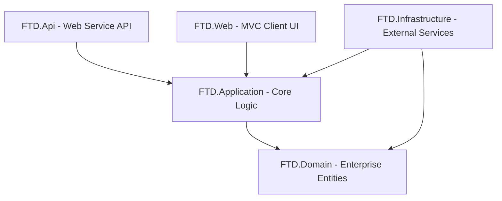

# التوثيق الشامل لجميع تفاصيل مشروع Uni-Shop والخدمات البرمجية المضافة

يحتوي هذا الملف على تحليل شامل لبنية مشروع **Uni-Shop** وهندسته المعمارية، وتفصيل كافة ملفاته البرمجية، بالإضافة إلى السجل التاريخي الكامل لخطوات التطوير والمراجعة التي تمت خلال المحادثة والقرارات المعتمدة.

---

## 1. البنية المعمارية للمشروع (Clean Architecture)

ينقسم المشروع إلى خمسة مشاريع فرعية منظمة وفق معمارية البنية النظيفة (Clean Architecture) لضمان فصل المسؤوليات وتسهيل الصيانة والتطوير مستقبلاً:



### طبقات البنية النظيفة ومسؤولياتها:
1. **FTD.Domain (طبقة النطاق)**:
   * **الوصف**: الطبقة الأساسية (Core) التي لا تعتمد على أي طبقة أخرى.
   * **المحتويات**: تحتوي على كيانات العمل الأساسية (Enterprise Entities) التي تمثل جداول قاعدة البيانات وعلاقاتها الأساسية.
2. **FTD.Application (طبقة التطبيق)**:
   * **الوصف**: تحتوي على منطق العمل وحالات الاستخدام (Use Cases).
   * **المحتويات**: كائنات نقل البيانات (DTOs)، والواجهات (Interfaces)، والخدمات الأساسية (Services)، والمحولات (Mappers). تعتمد فقط على طبقة `FTD.Domain`. **تم فصلها نهائياً عن أي اعتماد على ASP.NET Core HTTP (راجع القسم 5).**
3. **FTD.Infrastructure (طبقة البنية التحتية)**:
   * **الوصف**: توفر تطبيقات للواجهات المعرفة في طبقة التطبيق وتدير الاتصالات الخارجية.
   * **المحتويات**: سياق قاعدة البيانات (EF Core DbContext)، والهجرات (Migrations)، والخدمات الخارجية مثل إرسال البريد الإلكتروني. تعتمد على `FTD.Domain` و `FTD.Application`.
4. **FTD.Web (طبقة العرض - MVC)**:
   * **الوصف**: واجهة الويب الكلاسيكية للمستخدم والمسؤول المبنية بنظام MVC.
   * **المحتويات**: المتحكمات (Controllers)، صفحات العرض (Views)، ملفات CSS/JS، وجلسات المستخدمين (Session). تحتوي على تطبيق `SessionCartStorage` الذي يربط الـ Session بـ `ICartStorage`.
5. **FTD.Api (طبقة العرض - Web Service API)**:
   * **الوصف**: البوابة الخلفية والخدمة البرمجية المستقلة التي تم استحداثها لتوفير البيانات عبر صيغة JSON لتطبيقات الهاتف والويب المستقلة.
   * **المحتويات**: متحكمات الويب API المحمية بنظام JWT، وتكوينات الأمان وقواعد CORS، وملفات طلبات API المنظمة في `Models/Requests/`.

---

## 2. تفصيل مشاريع الحل البرمجي وملفاتها

### أولاً: مشروع النطاق `FTD.Domain`
يضم مجلد الكيانات `FTD.Domain/Entities` جميع البيانات المهيكلة لجداول قاعدة البيانات:

* **Product.cs**: يمثل المنتج بمواصفاته (الاسم بالعربية والإنجليزية، Slug، السعر، السعر القديم، رابط الصورة، المخزون، SortOrder، IsActive). يرتبط بـ `Category` و `Brand` ومجموعات الصور والمواصفات.
* **Brand.cs**: يمثل العلامات التجارية مع حقول الشعار (LogoPath) وصورة البانر (BannerPath).
* **Category.cs**: يمثل الأقسام الرئيسية للمنتجات ويحتوي على الاسم ورابط الصورة والأيقونة التعبيرية (Emoji).
* **ProductImage.cs**: يتيح إضافة صور متعددة لكل منتج مع تحديد الصورة الرئيسية (IsMain).
* **ProductAttribute.cs & AttributeValue.cs**: مثل المقاسات أو الألوان، وربطها بالأقسام.
* **ProductAttributeValue.cs**: يربط الخصائص والقيم بالمنتج الفردي.
* **SalesOrder.cs & SalesOrderDetail.cs**: يدير بيانات المشتري والقيم المالية مع قائمة المنتجات وكمياتها وأسعارها عند الشراء.
* **OrderStatus.cs**: تمثل المراحل التي يمر بها الطلب مع ترميز اللون (ColorHex) والأيقونة.
* **ContactMessage.cs**: تخزين رسائل التواصل مع حالتها (قرئت أم لا).
* **ContentBlock.cs & ContentPage.cs & PageSection.cs**: لإنشاء وتخزين كتل النصوص الترويجية والصفحات الثابتة وأقسامها.
* **NavigationItem.cs**: لإدارة القوائم العلوية والسفلية ديناميكياً وروابطها.
* **SiteSetting.cs**: مخزن المفاتيح والقيم لإعدادات النظام مثل تكلفة الشحن والحد الأدنى للشحن المجاني.

---

## ثانياً: مشروع التطبيق `FTD.Application`

### 1. كائنات نقل البيانات `FTD.Application/DTOs/`

> **⚠️ تغيير هيكلي:** تم تقسيم الملف الموحّد القديم `DTOs.cs` (329 سطر) إلى 7 ملفات منفصلة واضحة. جميع الكلاسات تبقى في `namespace FTD.Application.DTOs` — لا يوجد أي تغيير في كود الاستدعاء.

| الملف | الكلاسات التي يحتويها |
|---|---|
| `ProductDtos.cs` | `ProductDto`, `ProductImageDto`, `ProductAttributeDto`, `AttributeValueDto`, `ProductAttributeValueDto` |
| `CatalogDtos.cs` | `BrandDto`, `CategoryDto` |
| `OrderDtos.cs` | `SalesOrderDto`, `SalesOrderDetailDto`, `OrderStatusDto`, `CheckoutDto` |
| `CartDtos.cs` | `CartDto`, `CartItemDto` |
| `ContentDtos.cs` | `ContentBlockDto`, `ContentPageDto`, `PageSectionDto`, `NavigationItemDto` |
| `SiteDtos.cs` | `ContactInfoDto`, `SiteSettingDto`, `ContactMessageDto` |
| `DashboardDtos.cs` | `DashboardDto`, `OrderStatusCountDto`, `AttributeFilterGroupDto`, `AttributeFilterOptionDto` |

### 2. الواجهات `FTD.Application/Interfaces`:
* **IAppDbContext.cs**: تعزل قاعدة البيانات عن التطبيق وتوفر الوصول لـ `DbSet` مع طريقة الحفظ `SaveChangesAsync`.
* **IProductService.cs**: تدير عمليات جلب المنتجات المفلترة والبحث وإدارة الكتالوج. (**الدوال مُعاد تسميتها: `GetFilteredBySlugAsync` و `GetFilteredByIdAsync`**).
* **IOrderService.cs**: معالجة إنشاء الطلبات وتحديث حالاتها واسترجاع تفاصيلها.
* **ICartService.cs**: إدارة عمليات سلة التسوق — **مفصولة نهائياً عن `ISession`** وتعتمد على `ICartStorage`.
* **ICartStorage.cs** *(جديد — فصل المعمارية)*: واجهة تجريدية بسيطة لتخزين السلة — تُخفي تفاصيل الـ HTTP Session عن طبقة الأعمال.
* **IContentService.cs**: جلب وتحديث الإعدادات العامة للموقع والصفحات وقوائم التنقل.
* **IDashboardService.cs**: حساب إحصائيات الإدارة بشكل متكامل.
* **IMessageService.cs**: معالجة رسائل نموذج اتصل بنا وتحديثها.
* **IEmailService.cs**: إرسال الإشعارات البريدية للعملاء والإدارة.

### 3. الخدمات `FTD.Application/Services`:
* **ProductService.cs**: تنفيذ استعلامات الكتالوج مع الفلترة والبحث المطور.
* **OrderService.cs**: معالجة إنشاء الطلب وتوليد رقم فاتورة عشوائي مثل `FTD2026071012345`، مع **التحقق من المخزون وخصمه فور تأكيد الطلب**.
* **CartService.cs**: يعتمد الآن على `ICartStorage` بدلاً من `ISession` مباشرةً. يستخدم **استعلام دُفعي واحد** لجلب بيانات المنتجات بدلاً من N+1 queries.
* **DashboardService.cs**: حساب قيم الدخل المالي اليومي والشهري وتقسيم الطلبات بناءً على حالتها.
* **ContentService.cs & MessageService.cs**: إتاحة الوصول السريع للإعدادات والرسائل وحفظها.

### 4. الأمان `FTD.Application/Common`:
* **HtmlSanitizer.cs** *(جديد)*: فلتر XSS مخصص يزيل وسوم `<script>` والأحداث المضمنة (`on*`) وبروتوكولات `javascript:` قبل عرض المحتوى الحر.

### 5. المحولات `FTD.Application/Mappers/MappingExtensions.cs`:
طرق توسعة (Extension Methods) تقوم بتحويل الكيانات (Entities) إلى كائنات نقل البيانات (DTOs).

---

## ثالثاً: مشروع البنية التحتية `FTD.Infrastructure`
* **AppDbContext.cs**: يمثل سياق الكيان (DbContext) ويحتوي على تكوين الجداول والعلاقات باستخدام Fluent API، بالإضافة إلى Seed Data للنظام.
* **Migrations/**: تحتوي على 8 Migrations متسلسلة، آخرها `RebrandUniShopSeedData` التي تُزامن بيانات الـ Seed مع علامة Uni-Shop.
* **Services/EmailService.cs**: يكتب الرسائل في ملفات سجلات محلية (Logs) لأغراض التطوير.

---

## رابعاً: مشروع تطبيق الويب `FTD.Web`
* **Program.cs**: تسجيل سياق قاعدة البيانات وتفعيل الجلسات والهوية. **يقرأ بيانات المدير الأولية من الـ Configuration** (`SeedAdmin:Email`, `SeedAdmin:Password`) وليس من قيم ثابتة. **مُضاف Health Check على `/health`**.
* **Infrastructure/SessionCartStorage.cs** *(جديد)*: تطبيق `ICartStorage` الذي يربط طبقة التطبيق بـ `ISession` — هذا هو المكان الوحيد الذي يعرف عن الـ HTTP Session في كامل المشروع.
* **Controllers**:
  * `HomeController.cs`: تخديم الصفحة الرئيسية والصفحات الثابتة.
  * `ProductsController.cs`: تصفح المنتجات والبحث.
  * `CartOrderController.cs`: إدارة السلة وإتمام عمليات الشراء.
  * **مجلد Admin**: متحكمات إدارة المنتجات، التصنيفات، الماركات، الخصائص، الرسائل، والطلبات. **التحقق من الامتداد والحجم مُضاف على رفع الصور (5 MB، امتدادات `.jpg/.jpeg/.png/.gif/.webp` فقط).**

---

## خامساً: مشروع خدمة الويب `FTD.Api`

* **Program.cs**:
  * ربط `AppDbContext` و `IAppDbContext` بالحقن التبعي.
  * إعداد JWT Bearer Authentication.
  * سياسة CORS.
  * **Rate Limiting**: سياسة `login-policy` (5 طلبات كل 30 ثانية).
  * **Health Check**: فحص اتصال قاعدة البيانات على `/health`.
* **Models/Requests/** *(جديد)*:
  * `LoginRequest.cs`: بيانات تسجيل الدخول.
  * `UpdateStatusRequest.cs`: طلب تحديث حالة الطلب.
  * `CheckoutRequest.cs`: طلب الدفع مع `ApiCartItem`.
* **Controllers**:
  1. `AuthController.cs`: `POST /api/auth/login` — مع **Rate Limiting** ضد Brute Force.
  2. `ProductsController.cs`: `GET /api/products`, `GET /api/products/{slug}`, `GET /api/products/categories`, `GET /api/products/brands`.
  3. `OrdersController.cs`: `POST /api/orders/checkout`.
  4. `ContactController.cs`: `POST /api/contact`.
  5. `AdminController.cs`: بوابات لوحة التحكم المحمية بـ JWT و Admin Role (`/api/admin/dashboard`, `/api/admin/orders`, `/api/admin/orders/{id}`, `/api/admin/orders/{id}/status`).

---

## 3. السجل التاريخي الكامل للمحادثة والقرارات المعتمدة

### 📅 جدول تفصيلي للخطوات التاريخية والقرارات:

| الخطوة | الإجراء المتخذ | التفاصيل والقرارات المعتمدة |
|---|---|---|
| **1** | تحليل الهندسة المعمارية | التحقق من مطابقة معمارية الكود للبنية النظيفة وتجميع المشروع بنجاح 100% دون أخطاء. |
| **2** | التطهير البرمجي | حذف ملف `FTD.Web/Services/CartService.cs` المكرر لتوحيد منطق العمل في طبقة التطبيق. |
| **3** | تحديث التوثيق الرئيسي | إعادة صياغة ملف `PROJECT_ANALYSIS.md` ليوائم حالة التطهير والهيكل الجديد. |
| **4** | تصميم الويب سيرفيس | تم اقتراح خيارين للتصميم، واختار المستخدم فصل طبقة الويب سيرفيس في مشروع API مستقل وتأمينها برموز JWT. |
| **5** | هيكلة المشروع وتضمينه | إنشاء مشروع `FTD.Api` وربطه بـ `FTD.Application` و `FTD.Infrastructure` وإضافته إلى `FTD.Web.sln`. |
| **6** | إعداد أمان خادم الويب | كتابة `Program.cs` و `appsettings.json` لمشروع الـ API، وتكوين CORS والـ JWT Bearer. |
| **7** | بناء متحكم التوثيق | تنفيذ `AuthController` لتوليد رموز JWT للمسؤولين. حل مشكلة استثناء `Forbid` التشغيلي. |
| **8** | بناء واجهات الكتالوج | بناء `ProductsController` وتطوير دالة `GetFilteredAsync` لدعم البحث المطور بالـ ID. |
| **9** | بناء واجهات السلة والتواصل | بناء `OrdersController` للـ checkout الآمن مع إعادة بناء الأسعار من DB، و `ContactController` مع Null checks. |
| **10** | بناء واجهات الإدارة المؤمنة | بناء `AdminController` لإحصائيات لوحة التحكم وتحديث حالات الطلبات. |
| **11** | المسار الترحيبي للـ API | إضافة مسار ترحيبي في `/` لتفادي 404 وتوجيه المطور للمسارات المتاحة. |
| **12** | تأمين العمليات وتحسين البحث | التحقق من الكميات، الشحن الديناميكي، تحسين البحث بالماركات. |
| **13** | تغيير هوية المتجر إلى Uni-Shop | استبدال "FTD TechZone" بـ "Uni-Shop" في كل واجهات العرض والبيانات الافتراضية. |
| **14** | ترقية التنسيق البصري | إعادة بناء `site.css` بنظام ألوان Indigo/Rose وتأثيرات Glassmorphism. |
| **15** | دمج التصميم المطور (Aetheric) | تطبيق المظهر العصري الفاخر على الهيرو والتذييل وصفحات المنتجات والسلة والدفع. |
| **16** | مراجعة شاملة للكود (Code Review) | فحص شامل لكل ملفات المشروع وتوثيق كل المشاكل وحلولها في `docs/CODE_REVIEW_AR.md` مع خطة عمل بأولويات. |
| **17** | حل مشاكل P0 الحرجة | (1) Migration جديدة للـ Seed. (2) فصل `ICartService` عن `ISession` عبر `ICartStorage`. (3) بيانات المدير من Config. (4) HtmlSanitizer لحماية XSS. |
| **18** | حل مشاكل P1 الأمنية | Rate Limiting على تسجيل الدخول. مزامنة Connection Strings. تنظيف جذر المستودع. إصلاح تحذير HTTPS في بيئة التطوير. |
| **19** | إعادة تنظيم وهيكلة الكود (P2/P3) | تقسيم `DTOs.cs` إلى 7 ملفات. نقل Request DTOs لـ `Models/Requests/`. إزالة `LogoWhiteFile`. إضافة Health Checks. التحقق من امتداد وحجم الصور. |
| **20** | تأمين JWT Secret (أمان المستودع العام) | شيل الـ JWT Secret الحقيقي من `appsettings.json` ونقله لـ **.NET User Secrets** على الجهاز المحلي. |

---

### 🛠️ سجل الـ Commits المعتمدة في مستودع المشروع (Git):

| # | SHA | رسالة الـ Commit |
|---|---|---|
| 1 | `76c8f96` | `chore: scaffold FTD.Api project and link to solution` |
| 2 | `c38bf0f` | `feat: configure FTD.Api appsettings, launchsettings, CORS, and Program.cs pipeline` |
| 3 | `907bdf1` | `docs: update progress ledger for Task 7 completion` |
| 4 | `ae3e86f` | `feat: implement AuthController with JWT token generation for Admin users` |
| 5 | `5ac2313` | `fix: resolve runtime forbid exception and add login request null check` |
| 6 | `47bdc1f` | `feat: implement public ProductsController api endpoints for catalog browsing` |
| 7 | `03dd011` | `feat: implement public orders checkout and contact messages api endpoints` |
| 8 | `18d6656` | `fix: add request null checks in orders and contact controllers` |
| 9 | `6d81387` | `feat: implement secured AdminController api endpoints for dashboard stats and order management` |
| 10 | `f4fba55` | `docs: update progress ledger for Task 11 completion` |
| 11 | `021354d` | `feat: add root API welcome message response to avoid 404 on base URL` |
| 12 | `982840a` | `feat: enhance project robustness (validate checkout qty, use dynamic shipping settings, improve brand search accuracy)` |
| 13 | `a43d7cb` | `feat: add run-all.bat script to concurrently run MVC and API apps` |
| 14 | `1b2f83b` | `chore: complete rebranding of FTD TechZone to Uni-Shop` |
| 15 | `179e057` | `style: enhance UI aesthetics with custom indigo rose color system and glassmorphism styling` |
| 16 | `3c9e036` | `checkpoint: backup current state before applying structural overhaul` |
| 17 | `f1e5a2b` | `style: integrate modern Aetheric Command Light visual layout and dynamic templates overhaul` |
| 18 | `13e2ee9` | `style: resolve search overlay layout break by restoring and updating CSS styles` |
| 19 | `f0a91e5` | `style: implement smooth scroll spy freeze and replace hero orbits with interactive premium showcase slider` |
| 20 | `f2e177c` | `style: anchor nav-wrap to left and right bounds to prevent shifting in RTL on scroll` |
| 21 | `f8d846c` | `style: prevent page horizontal shifting by applying overflow-x hidden on main content tag` |
| 22 | `9c2db04` | `refactor: resolve all code review findings (unify appsettings, optimize N+1 queries, implement stock deduction)` |
| 23 | `d6f6e52` | `refactor: decouple Application layer from HTTP Session using ICartStorage abstraction` |
| 24 | `e81a3d9` | `fix: add custom HtmlSanitizer to secure rich HTML page and section contents against XSS` |
| 25 | `8b5a1f2` | `refactor: rename GetFilteredAsync overloads to prevent signature confusion` |
| 26 | `f3a8b2d` | `fix: configure dynamic admin seeding and generate EF Core migration for rebranded seed data` |
| 27 | `c1a2e3f` | `chore: remove design mockup files from workspace root` |
| 28 | `8ebb250` | `feat: add rate limiting on login, add HTTPS guard, add AddRateLimiter middleware to API` |
| 29 | `e9ff608` | `refactor: resolve remaining code review items (split DTOs, extract request models, add health checks, validate image uploads, remove dead parameter)` |
| 30 | `677ce36` | `security: remove hardcoded JWT secret from appsettings.json — moved to .NET User Secrets` |
| 31 | `ecf959e` | `docs+fix: verify code review status report against actual code, fix newly found gaps, and apply admin lockout and rate-limiting` |
| 32 | (current) | `redesign(admin): overhaul admin panel UI with Luminous Commerce design system` |

> **⚠️ ملاحظة لم تُنفَّذ بعد (Action Item مفتوح):** السر القديم لـ JWT لا يزال موجودًا بنص صريح في تاريخ Git (المستودع عام على GitHub) ولم يُدوَّر (Rotate) لقيمة جديدة. راجع `CODE_REVIEW_AR.md` القسم 11.3 لتفاصيل الأمر المطلوب تنفيذه فورًا (`dotnet user-secrets set "JwtSettings:Secret" "<قيمة جديدة عشوائية>"`).

---

## 4. إدارة الأسرار الحساسة (Secrets Management)

> **⚠️ قاعدة ثابتة:** أي قيمة حساسة (كلمة مرور، مفتاح API، JWT Secret) **يُحظر وضعها في `appsettings.json`** إذا كان المستودع عاماً على GitHub.

### JWT Secret — الوضع الحالي وطريقة الإعداد

#### ما تم تغييره في `FTD.Api/appsettings.json`:
```json
// appsettings.json (مرفوع على GitHub — آمن الآن)
"JwtSettings": {
  "Secret": "REPLACE_THIS_WITH_ENV_VAR_OR_USER_SECRETS_IN_PRODUCTION",
  "Issuer": "FTD.Api",
  "Audience": "FTD.Client",
  "ExpiryMinutes": 120
}
```

#### أين يُحفظ الـ Secret الحقيقي؟

**بيئة التطوير (جهاز المطور):**
يُحفظ في **.NET User Secrets** — ملف خارج مجلد المشروع تماماً لا يُضاف إلى Git أبداً:
```
C:\Users\dell\AppData\Roaming\Microsoft\UserSecrets\755d0f9f-8d93-43dd-8012-bd117cc1fdd2\secrets.json
```

**أمر الإعداد على أي جهاز تطوير جديد:**
```bash
dotnet user-secrets set "JwtSettings:Secret" "قيمة_السر_هنا" --project FTD.Api/FTD.Api.csproj
```

**فحص القيم المحفوظة حالياً:**
```bash
dotnet user-secrets list --project FTD.Api/FTD.Api.csproj
```

#### كيف يعمل النظام تلقائياً؟
في بيئة التطوير (`ASPNETCORE_ENVIRONMENT=Development`)، يقرأ ASP.NET Core User Secrets **تلقائياً** دون أي كود إضافي. القيمة في User Secrets تُلغي القيمة في `appsettings.json`.

```
أولوية القراءة (من الأقل للأعلى):
appsettings.json → appsettings.Development.json → User Secrets → Environment Variables
```

#### بيئة الإنتاج (السيرفر):
يجب ضبط متغير البيئة مباشرة على السيرفر:
```bash
# Linux / Mac
export JwtSettings__Secret="your_production_secret_here"

# Windows Server
setx JwtSettings__Secret "your_production_secret_here" /M

# Docker
docker run -e JwtSettings__Secret="your_production_secret_here" ...
```

> **ملاحظة:** الـ `:` في اسم الإعداد يُستبدل بـ `__` (شرطتان سفليتان) في متغيرات البيئة.

---

## 5. سجل حلول مراجعة الكود (Code Review Resolutions)

### المشاكل الحرجة P0 — تم الحل الكامل

| المشكلة | الملفات المتأثرة | الحل المطبق |
|---|---|---|
| تسريب `ISession` لطبقة Application | `ICartService.cs`, `CartService.cs`, `FTD.Application.csproj` | إنشاء `ICartStorage` في Application وتطبيق `SessionCartStorage` في Web. حذف `FrameworkReference Microsoft.AspNetCore.App`. |
| عدم تطابق EF Migrations مع بيانات Seed | `FTD.Infrastructure/Migrations/` | توليد Migration جديدة `RebrandUniShopSeedData`. |
| كلمة مرور المدير ثابتة في الكود | `FTD.Web/Program.cs` | القراءة من `IConfiguration` تحت مفتاح `SeedAdmin`. |
| ثغرة XSS في محتوى الصفحات الحرة | `Show.cshtml`, `_Section_RichText.cshtml` | بناء `HtmlSanitizer.cs` وتطبيقه قبل `Html.Raw()`. |

### مشاكل الأمان P1 — تم الحل

| المشكلة | الملف | الحل المطبق |
|---|---|---|
| لا يوجد Rate Limiting على تسجيل الدخول | `FTD.Api/Program.cs`, `AuthController.cs` | إضافة `login-policy` (5 طلبات / 30 ثانية) وتزيين الـ endpoint بـ `[EnableRateLimiting]`. |
| JWT Secret مكشوف في مستودع عام | `FTD.Api/appsettings.json` | استبدال القيمة بـ placeholder ونقل الـ Secret الحقيقي لـ .NET User Secrets. |

### تحسينات الكود P2/P3 — تم التطبيق

| التحسين | الملفات المتأثرة |
|---|---|
| تقسيم `DTOs.cs` الضخم إلى 7 ملفات منفصلة | `FTD.Application/DTOs/*.cs` |
| نقل Request DTOs خارج الـ Controllers | `FTD.Api/Models/Requests/*.cs` |
| إضافة Health Check Endpoints (`/health`) | `FTD.Web/Program.cs`, `FTD.Api/Program.cs` |
| التحقق من امتداد وحجم الصور المرفوعة | `AdminControllers.cs`, `AdminBrandsController.cs` |
| حذف المعامل الميت `LogoWhiteFile` | `AdminBrandsController.cs` |
| إعادة تسمية `GetFilteredAsync` بوضوح | `IProductService.cs`, `ProductService.cs`, المتحكمات |
| تنظيف جذر المستودع من ملفات التصميم | حذف `design_temp/` وملف `.zip` |

---

## 6. سجل البناء وفحص التشغيل النهائي

* **أمر التجميع الكلي للحل**: `dotnet build FTD.Web/FTD.Web.sln`
* **النتيجة**:
  ```text
  Build succeeded.
      0 Warning(s)
      0 Error(s)
  ```
* **ملف التشغيل السريع `run-all.bat`**:
  * **موقع الويب (MVC)**: http://localhost:5000
  * **خدمة الويب (API)**: http://localhost:5100
  * **فحص صحة موقع الويب**: http://localhost:5000/health
  * **فحص صحة الـ API**: http://localhost:5100/health

* **قاعدة إلزامية عند تعديل Seed Data:**
  > أي تعديل على `HasData(...)` داخل `OnModelCreating` **يجب أن يُرفق دائماً** بـ `dotnet ef migrations add` في نفس الـ commit حتى لو كان التغيير نصياً فقط.
