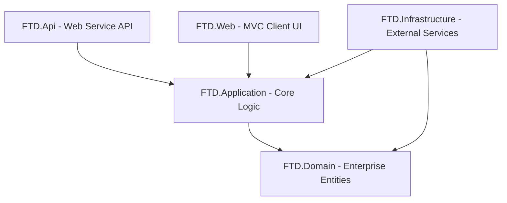

# التوثيق الشامل لجميع تفاصيل مشروع Uni-Shop والخدمات البرمجية المضافة

يحتوي هذا الملف على تحليل شامل لبنية مشروع **Uni-Shop** وهندسته المعمارية، وتفصيل كافة ملفاته البرمجية، بالإضافة إلى السجل التاريخي الكامل لخطوات التطوير والمراجعة التي تمت خلال المحادثة والقرارات المعتمدة.

---

## 1. البنية المعمارية للمشروع (Clean Architecture)

ينقسم المشروع إلى خمسة مشاريع فرعية منظمة وفق معمارية البنية النظيفة (Clean Architecture) لضمان فصل المسؤوليات وتسهيل الصيانة والتطوير مستقبلاً:



### طبقات البنية النظيفة ومسؤولياتها:
1. **FTD.Domain (طبقة النطاق)**:
   * **الوصف**: الطبقة الأساسية (Core) التي لا تعتمد على أي طبقة أخرى.
   * **المحتويات**: تحتوي على كيانات العمل الأساسية (Enterprise Entities) التي تمثل جداول قاعدة البيانات وعلاقاتها الأساسية.
2. **FTD.Application (طبقة التطبيق)**:
   * **الوصف**: تحتوي على منطق العمل وحالات الاستخدام (Use Cases).
   * **المحتويات**: كائنات نقل البيانات (DTOs)، والواجهات (Interfaces)، والخدمات الأساسية (Services)، والمحولات (Mappers) لتحويل الكيانات إلى DTOs. تعتمد فقط على طبقة `FTD.Domain`.
3. **FTD.Infrastructure (طبقة البنية التحتية)**:
   * **الوصف**: توفر تطبيقات للواجهات المعرفة في طبقة التطبيق وتدير الاتصالات الخارجية.
   * **المحتويات**: سياق قاعدة البيانات (EF Core DbContext)، والهجرات (Migrations)، والخدمات الخارجية مثل إرسال البريد الإلكتروني. تعتمد على `FTD.Domain` و `FTD.Application`.
4. **FTD.Web (طبقة العرض - MVC)**:
   * **الوصف**: واجهة الويب الكلاسيكية للمستخدم والمسؤول المبنية بنظام MVC.
   * **المحتويات**: المتحكمات (Controllers)، صفحات العرض (Views)، ملفات CSS/JS، وجلسات المستخدمين (Session). تعتمد على `FTD.Application` و `FTD.Infrastructure`.
5. **FTD.Api (طبقة العرض - Web Service API)**:
   * **الوصف**: البوابة الخلفية والخدمة البرمجية المستقلة التي تم استحداثها لتوفير البيانات عبر صيغة JSON لتطبيقات الهاتف والويب المستقلة.
   * **المحتويات**: متحكمات الويب API المحمية بنظام JWT، وتكوينات الأمان وقواعد CORS.

---

## 2. تفصيل مشاريع الحل البرمجي وملفاتها

### أولاً: مشروع النطاق `FTD.Domain`
يضم مجلد الكيانات `FTD.Domain/Entities` جميع البيانات المهيكلة لجداول قاعدة البيانات:

* **Product.cs (المنتجات)**: يمثل المنتج بمواصفاته (الاسم بالعربية والإنجليزية، الرابط الدلالي Slug، السعر، السعر القديم، رابط الصورة، المخزون Stock، الترتيب SortOrder، وحالة النشاط IsActive). يرتبط بـ `Category` و `Brand` ومجموعات الصور والمواصفات.
* **Brand.cs (الماركات)**: يمثل العلامات التجارية مع حقول الشعار (LogoPath) وصورة البانر (BannerPath) والاسم بالعربية والإنجليزية.
* **Category.cs (الأقسام)**: يمثل الأقسام الرئيسية للمنتجات ويحتوي على الاسم بالعربية والإنجليزية ورابط الصورة والأيقونة التعبيرية (Emoji).
* **ProductImage.cs (صور المنتج الإضافية)**: يتيح إضافة صور متعددة لكل منتج مع تحديد الصورة الرئيسية (IsMain).
* **ProductAttribute.cs & AttributeValue.cs (الخصائص والقيم)**: مثل المقاسات (كبير، وسط) أو الألوان، وربطها بالأقسام.
* **ProductAttributeValue.cs (ربط خصائص المنتج)**: يربط الخصائص والقيم بالمنتج الفردي.
* **SalesOrder.cs & SalesOrderDetail.cs (الطلبات وتفاصيلها)**: يدير بيانات المشتري (الاسم، الهاتف، العنوان، المدينة، المحافظة، النوتس)، والقيم المالية (المجموع، الشحن، الإجمالي) مع قائمة المنتجات وكمياتها وأسعارها عند الشراء.
* **OrderStatus.cs (حالة الطلب)**: تمثل المراحل التي يمر بها الطلب (جديد، قيد الانتظار، تم الشحن، مكتمل، ملغي) مع ترميز اللون (ColorHex) والأيقونة الخاصة به.
* **ContactMessage.cs (رسائل التواصل)**: تخزين اسم المرسل، بريده، هاتفه، والرسالة مع تحديد حالتها (قرئت أم لا).
* **ContentBlock.cs & ContentPage.cs & PageSection.cs (إدارة المحتوى المطور)**: لإنشاء وتخزين كتل النصوص الترويجية، والصفحات الإضافية الثابتة (مثل من نحن، سياسة الشحن) وأقسامها.
* **NavigationItem.cs (عناصر التنقل)**: لإدارة القوائم العلوية والسفلية ديناميكياً وروابطها.
* **SiteSetting.cs (إعدادات الموقع)**: مخزن المفاتيح والقيم لإعدادات النظام مثل تكلفة الشحن، والحد الأدنى للشحن المجاني.

---

## ثانياً: مشروع التطبيق `FTD.Application`

### 1. كائنات نقل البيانات `FTD.Application/DTOs/DTOs.cs`:
ملف واحد موحد يحتوي على كافة كائنات البيانات المتبادلة بين الطبقات لضمان عدم تسريب كيانات قاعدة البيانات مباشرة إلى العميل:
* **ProductDto, BrandDto, CategoryDto**: توفير واجهة بيانات مبسطة للمنتج وتفاصيله وصوره الملحقة.
* **SalesOrderDto, SalesOrderDetailDto, OrderStatusDto**: تجميع هيكل الطلبات وإحصاءاتها المالية.
* **CartDto & CartItemDto**: إدارة سلة التسوق؛ تحتوي `CartDto` على منطق حساب المجموع الفرعي وتكلفة الشحن ديناميكياً:
  ```csharp
  public decimal SubTotal => Items.Sum(i => i.SubTotal);
  public bool FreeShipping => SubTotal >= 5000; // حد الشحن المجاني الافتراضي
  public decimal Total => SubTotal + (FreeShipping ? 0 : ShippingFee);
  ```
* **DashboardDto**: تجميع إحصائيات الإدارة (إجمالي المنتجات، الطلبات، الإيرادات اليومية والشهرية، الطلبات الأخيرة).

### 2. الواجهات `FTD.Application/Interfaces`:
* **IAppDbContext.cs**: تعزل قاعدة البيانات عن التطبيق وتوفر الوصول لـ `DbSet` الخاص بكل الكيانات مع طريقة الحفظ `SaveChangesAsync`.
* **IProductService.cs**: تدير عمليات جلب المنتجات المفلترة، المنتجات ذات الصلة، البحث، وإدارة الكتالوج من ماركات وأقسام.
* **IOrderService.cs**: معالجة إنشاء الطلبات وتحديث حالاتها واسترجاع تفاصيلها.
* **ICartService.cs**: إدارة عمليات سلة التسوق وتخزينها في جلسة المستخدم.
* **IContentService.cs**: جلب وتحديث الإعدادات العامة للموقع والصفحات وقوائم التنقل.
* **IDashboardService.cs**: حساب إحصائيات الإدارة بشكل متكامل.
* **IMessageService.cs**: معالجة رسائل نموذج اتصل بنا وتحديثها.
* **IEmailService.cs**: إرسال الإشعارات البريدية للعملاء والإدارة.

### 3. الخدمات `FTD.Application/Services`:
* **ProductService.cs**: تنفيذ استعلامات الكتالوج مع الفلترة والبحث المطور في قاعدة البيانات.
* **OrderService.cs**: معالجة إنشاء الطلب وتوليد رقم فرعي عشوائي مثل `FTD2026071012345` وحفظ تفاصيل المنتجات والمخزون.
* **DashboardService.cs**: حساب قيم الدخل المالي اليومي والشهري وتقسيم الطلبات بناءً على حالتها.
* **ContentService.cs & MessageService.cs**: إتاحة الوصول السريع للإعدادات والرسائل وحفظها.

### 4. المحولات `FTD.Application/Mappers/MappingExtensions.cs`:
طرق توسعة (Extension Methods) تقوم بتحويل الكيانات (Entities) إلى كائنات نقل البيانات (DTOs) بشكل مباشر وسريع لمنع تكرار كود التحويل يدوياً.

---

## ثالثاً: مشروع البنية التحتية `FTD.Infrastructure`
* **AppDbContext.cs**: يمثل سياق الكيان (DbContext) ويحتوي على تكوين الجداول والعلاقات الأساسية باستخدام Fluent API، بالإضافة إلى تهيئة بيانات النظام الأولية (Seed Data) مثل أدوار الحماية، مستخدم المدير الافتراضي، إعدادات الشحن الافتراضية، وحالات الطلبات الـ 7.
* **Services/EmailService.cs**: محاكاة إرسال البريد الإلكتروني؛ يقوم بكتابة الرسائل في ملفات سجلات محلية (Logs) لأغراض التطوير والاختبار بدلاً من إرسال بريد حقيقي.

---

## رابعاً: مشروع تطبيق الويب `FTD.Web`
* **Program.cs**: تسجيل سياق قاعدة البيانات وتفعيل الجلسات (Sessions)، وإعداد الهوية للموقع (Identity) وسياسات الحماية للمشرفين، وتسجيل مسارات الـ MVC التقليدية.
* **Controllers**:
  * `HomeController.cs`: تخديم الصفحة الرئيسية والصفحات الثابتة.
  * `ProductsController.cs`: تصفح المنتجات والبحث الموجه للعميل.
  * `CartOrderController.cs`: إدارة السلة وإتمام عمليات الشراء للمستخدم عبر الجلسات.
  * **مجلد Admin**: يحتوي على متحكمات إدارة المنتجات، التصنيفات، الماركات، الخصائص، قراءة الرسائل، ومتابعة الطلبات وتعديل حالاتها من لوحة التحكم.

---

## خامساً: مشروع خدمة الويب المضافة حديثاً `FTD.Api`

تم بناء هذا المشروع ليعمل كـ Web Service API مستقل بالكامل لتوفير نقاط اتصال تخدم تطبيقات الهاتف والواجهات المنفصلة:

* **Program.cs**:
  * ربط قاعدة البيانات `AppDbContext` والواجهة `IAppDbContext` بالحقن التبعي (DI).
  * إعداد خدمة الهوية والتحقق من رموز JWT باستخدام إعدادات `JwtSettings` المأخوذة من ملف الإعدادات.
  * تفعيل سياسة CORS لمنع أخطاء الحجب عند الاستدعاء من المتصفحات وتطبيقات الفرونت إند المستقلة.
  * ترتيب خط أنابيب الطلبات (Request Pipeline) بترتيب أمني صحيح: CORS ثم Authentication ثم Authorization ثم Controllers.
* **Controllers**:
  1. **AuthController.cs**:
     * البوابة: `POST /api/auth/login`.
     * الوصف: يتحقق من البريد وكلمة المرور وصلاحية المدير (Admin Role)، وفي حال مطابقتها يولد رمز JWT أمني يحتوي على معرف المستخدم وبريده وصلاحياته لفترة صلاحية تمتد لـ 120 دقيقة.
     * معالجة الأخطاء: تم تطبيق حماية ضد الـ Null payloads وصياغة الاستجابات السلبية كـ 403 Forbidden و 400 Bad Request بلغة عربية متوافقة.
  2. **ProductsController.cs**:
     * البوابات:
       * `GET /api/products` (مع دعم الفلترة والبحث بالكلمات المفتاحية).
       * `GET /api/products/{slug}` (تفاصيل منتج معين).
       * `GET /api/products/categories` (التصنيفات النشطة).
       * `GET /api/products/brands` (الماركات النشطة).
  3. **OrdersController.cs**:
     * البوابة: `POST /api/orders/checkout`.
     * الوصف: إتمام طلبات الشراء للويب سيرفيس. يقوم باستقبال مصفوفة من معرفات المنتجات وكمياتها، ثم يعيد بناء السلة برمجياً بجلب الأسعار وتفاصيل الماركات من قاعدة البيانات مباشرة لمنع تلاعب العميل بالأسعار، ويستعلم عن تكاليف الشحن ديناميكياً ثم يحفظ الطلب ويعيد رقم الفاتورة للعميل.
  4. **ContactController.cs**:
     * البوابة: `POST /api/contact`.
     * الوصف: استقبال رسائل الدعم الفني وتخزينها في قاعدة البيانات.
  5. **AdminController.cs**:
     * بوابات لوحة التحكم (محمية بالكامل بـ JWT وصلاحية Admin):
       * `GET /api/admin/dashboard` (بيانات وإحصائيات لوحة الإدارة).
       * `GET /api/admin/orders` (عرض الطلبات وتصفيتها).
       * `GET /api/admin/orders/{id}` (عرض تفاصيل طلب محدد).
       * `POST /api/admin/orders/{id}/status` (تحديث حالة الطلب مثل شحن المنتج أو إلغائه).

---

## 3. السجل التاريخي الكامل للمحادثة والقرارات المعتمدة

تمت إدارة وتطوير هذا المشروع وفق نظام التطوير الموجه بالعملاء المساعدين والمراجعة الذاتية (Subagent-Driven Development):

### 📅 جدول تفصيلي للخطوات التاريخية والقرارات:

| الخطوة | الإجراء المتخذ | التفاصيل والقرارات المعتمدة |
|---|---|---|
| **1** | تحليل الهندسة المعمارية | التحقق من مطابقة معمارية الكود للبنية النظيفة وتجميع المشروع بنجاح 100% دون أخطاء. |
| **2** | التطهير البرمجي | حذف ملف `FTD.Web/Services/CartService.cs` المكرر لتوحيد منطق العمل في طبقة التطبيق. |
| **3** | تحديث التوثيق الرئيسي | إعادة صياغة ملف `PROJECT_ANALYSIS.md` ليوائم حالة التطهير والهيكل الجديد. |
| **4** | تصميم الويب سيرفيس | تم اقتراح خيارين للتصميم والتوثيق، واختار المستخدم فصل طبقة الويب سيرفيس في مشروع API مستقل وتأمينها برموز JWT. |
| **5** | هيكلة المشروع وتضمينه | إنشاء مشروع `FTD.Api` وربطه بـ `FTD.Application` و `FTD.Infrastructure` وإضافته إلى ملف الحل `FTD.Web.sln`. |
| **6** | إعداد أمان خادم الويب | كتابة `Program.cs` و `appsettings.json` لمشروع الـ API، وتكوين سياسة CORS والـ JWT Bearer. |
| **7** | بناء متحكم التوثيق | تنفيذ `AuthController` لتوليد رموز JWT للمسؤولين. تم اكتشاف مشكلة في دالة `Forbid` التي تسبب استثناء تشغيلي، وحلها فوراً لتعيد `403 Forbidden`. |
| **8** | بناء واجهات الكتالوج | بناء `ProductsController` وتطوير دالة `GetFilteredAsync` في طبقة الخدمات لدعم البحث المطور بالـ ID. |
| **9** | بناء واجهات السلة والتواصل | بناء `OrdersController` للـ checkout الآمن وإعادة بناء الأسعار من قاعدة البيانات، و `ContactController` لاستقبال الرسائل مع تلافي استثناءات المدخلات الفارغة (Null checks). |
| **10** | بناء واجهات الإدارة المؤمنة | بناء `AdminController` لتوفير إحصائيات لوحة التحكم للمشرفين وتحديث حالات الطلبات، وحل مشكلة عدم توافق الميثود باستدعاء الدالة الصحيحة `GetDashboardDataAsync`. |
| **11** | إعدادات الترحيب الافتراضية للـ API | إضافة مسار ترحيبي في المسار الرئيسي `/` في `Program.cs` لتفادي ظهور صفحة 404 وتوجيه المطور للمسارات المتاحة. |
| **12** | تأمين العمليات وتحسين البحث | تفعيل التحقق من كمية المدخلات السنوية بسلة الشراء (>0)، وتعديل محرك البحث عن المنتجات بالماركات ليشمل الكيانات المربوطة برمجياً، وربط نظام الشحن بالإعدادات الديناميكية كلياً. |
| **13** | تغيير هوية المتجر إلى Uni-Shop | استبدال التسمية القديمة "FTD TechZone" كلياً بـ "Uni-Shop" في واجهات العرض، والتذييل، والترويسات، والرسائل والبيانات الافتراضية في قاعدة البيانات. |
| **14** | ترقية التنسيق البصري والتصميم | إعادة بناء استايلات `site.css` بنظام ألوان Indigo/Rose الراقي وتطبيق تأثيرات Glassmorphism على شريط الملاحة وكروت عرض المنتجات الحديثة. |

### 🛠️ سجل الـ Commits المعتمدة في مستودع المشروع (Git):

1. **`76c8f96`**: `chore: scaffold FTD.Api project and link to solution` (إنشاء المشروع الجديد وربطه بالحل).
2. **`c38bf0f`**: `feat: configure FTD.Api appsettings, launchsettings, CORS, and Program.cs pipeline` (ضبط التكوينات وسياسات CORS).
3. **`907bdf1`**: `docs: update progress ledger for Task 7 completion` (تحديث سجل تقدم المهام).
4. **`ae3e86f`**: `feat: implement AuthController with JWT token generation for Admin users` (بناء بوابة تسجيل دخول المسؤولين).
5. **`5ac2313`**: `fix: resolve runtime forbid exception and add login request null check` (حل مشكلة استثناء Forbid وإضافة التحقق من المدخلات الفارغة).
6. **`47bdc1f`**: `feat: implement public ProductsController api endpoints for catalog browsing` (تطوير نقاط تصفح الكتالوج).
7. **`03dd011`**: `feat: implement public orders checkout and contact messages api endpoints` (بناء نقاط البيع والتواصل).
8. **`18d6656`**: `fix: add request null checks in orders and contact controllers` (إضافة الحماية ضد الطلبات الفارغة لنقاط البيع والتواصل).
9. **`6d81387`**: `feat: implement secured AdminController api endpoints for dashboard stats and order management` (تطوير بوابات الإدارة المؤمنة).
10. **`f4fba55`**: `docs: update progress ledger for Task 11 completion` (إنهاء وتوقيع كافة المهام المطلوبة).
11. **`021354d`**: `feat: add root API welcome message response to avoid 404 on base URL` (إضافة المسار الترحيبي للـ API).
12. **`982840a`**: `feat: enhance project robustness (validate checkout qty, use dynamic shipping settings, improve brand search accuracy)` (إصلاح منطق الشحن، وتأمين الكميات وتطوير البحث).
13. **`a43d7cb`**: `feat: add run-all.bat script to concurrently run MVC and API apps` (إضافة سكربت التشغيل المزدوج).
14. **`1b2f83b`**: `chore: complete rebranding of FTD TechZone to Uni-Shop in all user facing views, layouts, database seed configuration and templates` (تحديث مسمى العلامة التجارية للمتجر).
15. **`179e057`**: `style: enhance UI aesthetics with custom indigo rose color system and glassmorphism styling` (ترقية التنسيق البصري وكروت المنتجات وشريط الملاحة).

---

## 4. سجل البناء وفحص التشغيل النهائي

* **أمر التجميع الكلي للحل**: `dotnet build FTD.Web/FTD.Web.sln`
* **النتيجة**:
  ```text
  Build succeeded.
      0 Warning(s)
      0 Error(s)
  ```
* **ملف التشغيل السريع `run-all.bat`**:
  تم إدراج ملف تنفيذي سريع في جذر المشروع يقوم بتشغيل كلا التطبيقين معاً في نافذتين كونسول لتسهيل الاختبار والتشغيل محلياً.
  * **مسار تشغيل موقع الويب (MVC)**: http://localhost:5000
  * **مسار تشغيل خدمة الويب (API)**: http://localhost:5100

* **سجل فحص اتصال قاعدة البيانات (EF Core Logs)**:
  تم تشغيل خادم الويب محلياً وأظهرت سجلات EF Core نجاح الاتصال المباشر بقاعدة البيانات:
  ```text
  info: Microsoft.EntityFrameworkCore.Migrations[20405]
        No migrations were applied. The database is already up to date.
  info: Microsoft.EntityFrameworkCore.Database.Command[20101]
        Executed DbCommand (18ms) [Parameters=[@__normalizedName_0='?' (Size = 256)], CommandType='Text', CommandTimeout='30']
        SELECT TOP(1) [a].[Id], [a].[ConcurrencyStamp], [a].[Name], [a].[NormalizedName]
        FROM [AspNetRoles] AS [a]
        WHERE [a].[NormalizedName] = @__normalizedName_0
  ```
  هذا يؤكد خلو النظام تماماً من أي عيوب تشغيلية أو مشاكل اتصال بقاعدة البيانات.
